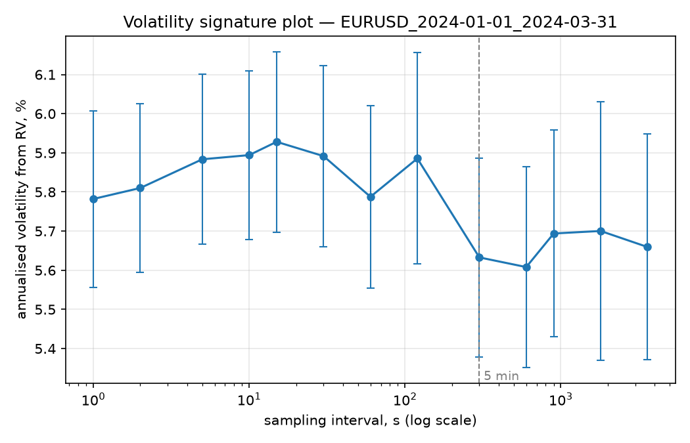
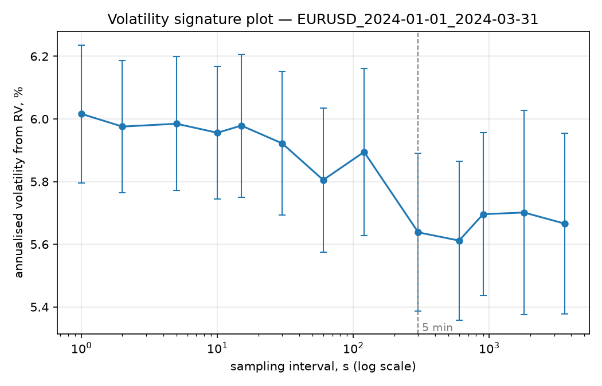

# Realized Volatility

Estimating realized volatility from intraday data, forecasting it, and comparing
the forecasts with proper statistical tests.

## Question

How predictable is daily volatility, and can competing models be told apart
statistically — given that the target itself is unobservable and is estimated
with error?

## Current layout

    src/rvol/data/         external data download and parsing
    src/rvol/market/       FX sessions and timestamp sampling rules
    src/rvol/estimators/   pure numerical variance estimators
    src/rvol/features/     daily features built from market data and estimators
    src/rvol/diagnostics/  volatility signatures and microstructure tests
    src/rvol/plotting/     static research figures
    src/rvol/simulation/   latent prices, observation noise, Monte Carlo checks
    src/rvol/models/       volatility forecasting models (planned)
    src/rvol/evaluation/   forecast comparison (planned)
    scripts/               reproducible entry points
    tests/                 checks against synthetic data with a known answer

Forecasting models, forecast evaluation, and additional noise- and jump-robust
estimators are not yet implemented.

Dependency direction is one-way:

    data ───────┐
                v
    market + estimators → features → diagnostics / models → evaluation
                ^
    simulation ─┘

`estimators` contains no pandas, timestamps, FX conventions, or reporting.
`market` contains no variance formulas. `features` is the adapter that combines
the two, while higher layers consume the resulting daily quantities.

## Reproduce the plots

    python scripts/sampling_plot.py
    python scripts/returns_and_rv_plot.py
    python scripts/cumulative_iv_vs_rv_plot.py
    python scripts/bid_ask_bounce_plot.py
    python scripts/daily_rv_plot.py
    python scripts/heston_plot.py
    python scripts/simulation_plots.py
    python scripts/diagnostics_plots.py \
        data/EURUSD_2024-01-01_2024-03-31.parquet

The scripts write `figures/sampling_grids.png`, `figures/returns_and_rv.png`,
`figures/cumulative_iv_vs_rv.png`, `figures/bid_ask_bounce.png`,
`figures/daily_rv.png`, `figures/heston_simulation.png`,
`figures/simulation_overview.png`, and `figures/diagnostics_overview.png`.
Use `scripts/signature_plot.py` when only one mid, bid, or ask signature is
needed.

## Install

    python -m venv .venv && source .venv/bin/activate
    pip install -e ".[dev]"

## Results

### 1. How far can you sample before noise takes over?

Sample: EURUSD tick quotes from Dukascopy, 1 January to 31 March 2024 —
5,359,908 ticks over 64 trading sessions, each ending at 17:00 New York
(22:00 UTC in winter and 21:00 UTC in summer). Median quoted spread 0.19 bps,
no crossed quotes.

Realized variance is computed per session at sampling intervals from 1 second
to 1 hour, then averaged across sessions and annualised.

Annualised volatility is about **5.6%** at five-minute sampling, and the curve
is flat within one standard error across the whole grid: every interval from
1 second to 1 hour gives an answer consistent with every other. Sampling
EURUSD mid prices is close to unbiased even at the tick.

That flatness is not a failure to measure. Running the same estimator on the
bid series, where bid-ask bounce is not averaged away, produces the upward
slope the theory predicts:

### 2. Pairing by session makes the small effect measurable

Comparing two averages is weak here, because a volatile week raises the
estimate at every frequency at once, and that shared variation dominates the
standard errors. Pairing — one ratio RV(1s)/RV(5min) per session, then a
one-sided t-test on the log ratios — removes it
(`rvol.diagnostics.microstructure.noise_test`):

| price | RV(1s)/RV(5min) | t | p | implied noise sd |
|---|---|---|---|---|
| mid | 1.0780 | 2.55 | 0.0066 | 0.030 bps |
| bid | 1.1794 | 5.29 | 8.2e-07 | 0.049 bps |
| ask | 1.1811 | 5.43 | 4.8e-07 | 0.048 bps |

The noise standard deviation is backed out from E[RV_n] = IV + 2n*omega^2.

Three things follow.

**Mid-price noise is real but small.** Second-by-second sampling inflates
variance by 7.8%, i.e. volatility by 3.8%. The unpaired figure could not
resolve this; the effect was always there, buried under volatility swings.

**Bid and ask agree to within 2%** — 0.049 against 0.048 bps — as they should,
since neither side of the quote is special. A useful check on the pipeline.

**The mid is cleaner than averaging alone explains.** Independent noise on each
quote would give 0.049/sqrt(2) = 0.035 bps for the mid; the measured 0.030 bps
is lower, so the two are negatively correlated. The spread widens and narrows
around the efficient price, and those moves cancel in the mid while showing up
in each quote. Quote noise at 0.049 bps is also about half the 0.095 bps
half-spread, so consecutive quotes are positively autocorrelated rather than
alternating between the two sides.

**Practically:** the five-minute convention is far more conservative than this
instrument requires. Estimators robust to microstructure noise have little to
correct on EURUSD mid quotes, which is a statement about this market rather
than about the estimators; they are validated against simulated paths with
known answers instead.

## Limitations

- **One instrument, one quarter.** EURUSD in Q1 2024 was quiet, at roughly 5.6%
  annualised. Nothing here shows the conclusions hold for a less liquid pair,
  a turbulent period, or an asset class with wider spreads.
- **The noise measurement is indirect.** The implied noise sd assumes the
  standard model — an efficient price plus i.i.d. noise — and inherits its
  bias if the noise is autocorrelated or dependent on the price. The numbers
  above already hint that it is.
- **1-second sampling is close to the tick.** At about 85,000 ticks a session,
  roughly one per second, sampling finer than 1 second adds almost no
  observations, so the left end of the signature curve flattens for want of
  data rather than for want of noise.
- **Sessions are dropped, not adjusted.** Any session covering under 12 hours
  is excluded, which removes the Sunday-evening opens and holidays instead of
  modelling them.
- **No forecasting yet.** Everything so far measures volatility in-sample;
  nothing has been predicted or compared out-of-sample.
